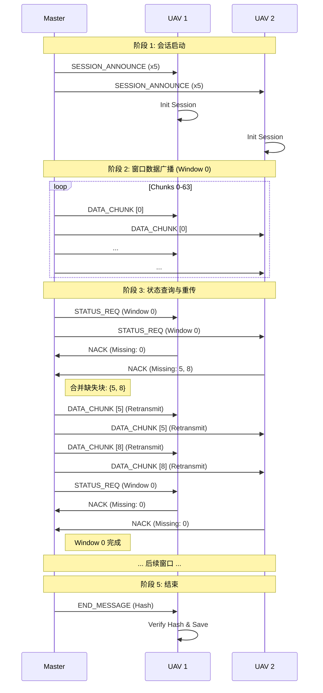

# 无人机群通信模拟系统 (UAV Swarm Communication Simulation)

## 1. 项目简介

本项目是一个用于模拟无人机群（UAV Swarm）之间进行高可靠文件广播的通信系统。它在不可靠的 UDP 组播基础上，实现了一套应用层可靠传输协议（Reliable Multicast Protocol），能够支持 Master 节点向多个 UAV 节点高效分发大文件（如固件更新、地图数据），并具备丢包检测与重传能力。

**核心特性：**
*   **一对多广播**：利用 UDP 组播技术，一次发送，全网接收，节省带宽。
*   **可靠传输**：基于 NACK（负向确认）的重传机制，仅重传丢失的数据块。
*   **硬件仿真**：引入发送/接收队列和独立传输线程，模拟真实嵌入式硬件的 DMA/FIFO 行为。
*   **抗拥塞控制**：包含 NACK 抑制、随机退避和发送速率控制。
*   **状态同步**：通过 Bitmap 精确追踪每个 UAV 的接收状态。

---

## 2. 系统架构

系统采用 **Master-Slave** 架构，包含两个主要角色：

### 2.1 角色定义
*   **Master (发送方)**：
    *   负责发起文件传输会话。
    *   将文件切分为固定大小的数据块 (Chunk)。
    *   按窗口 (Window) 广播数据。
    *   查询 UAV 接收状态并重传丢失块。
*   **Receiver (接收方/UAV)**：
    *   监听组播频道。
    *   接收并缓存数据块，写入本地文件。
    *   维护接收位图 (Bitmap)。
    *   响应 Master 的状态查询，报告缺失块 (NACK)。

### 2.2 传输层抽象 (Transport Layer)
为了适配嵌入式开发习惯，项目在 Socket 之上封装了一层传输层：
*   **发送队列 (Tx Queue)**：业务逻辑只需将报文 `push` 进队列，后台线程负责从队列 `pop` 并通过 UDP 发送。
*   **接收队列 (Rx Queue)**：后台线程负责从 UDP 接收报文并 `push` 进队列，业务逻辑从队列 `pop` 处理。
*   **优势**：解耦了网络 I/O 与业务逻辑，模拟了硬件中断/DMA 的工作方式。

---

## 3. 协议设计 (Broadcast Protocol)

协议定义在 `broadcast_protocol.h` 中，采用紧凑的二进制格式（`__attribute__((packed))`）。

### 3.1 消息类型
| 消息类型 | ID | 方向 | 描述 |
| :--- | :--- | :--- | :--- |
| `MSG_SESSION_ANNOUNCE` | 1 | Master -> All | 广播文件元信息（文件名、大小、分块数），启动会话。 |
| `MSG_DATA_CHUNK` | 2 | Master -> All | 携带实际文件数据块，包含 Chunk ID 和 CRC 校验。 |
| `MSG_STATUS_REQ` | 3 | Master -> All | 询问指定窗口的接收状态。 |
| `MSG_NACK` | 4 | UAV -> Master | 报告缺失的数据块（Bitmap 格式），或确认已收齐。 |
| `MSG_END` | 5 | Master -> All | 传输结束，携带全文件 Hash 用于最终校验。 |

### 3.2 传输机制
*   **分块 (Chunking)**：文件被分割为 1KB 的块。
*   **窗口 (Windowing)**：每 64 个块组成一个窗口。Master 只有在确认当前窗口所有 UAV 都收齐（或达到最大重传次数）后，才进入下一个窗口。
*   **Bitmap**：使用 64-bit 整数表示一个窗口内的接收状态，1 bit 对应 1 个块。

---

## 4. 代码结构与组件详解

### 4.1 `broadcast_protocol.h` (协议头文件)
定义了所有数据结构、宏配置和接口声明。
*   **配置宏**：`MULTICAST_GROUP`, `WINDOW_SIZE` (64), `MAX_CHUNK_SIZE` (1024)。
*   **数据结构**：`PacketQueue` (环形队列), `MasterSession`, `ReceiverSession`。

### 4.2 `common.c` (公共组件与传输层)
实现了底层设施，不包含业务逻辑。

**核心接口：**
*   `transport_init(bool is_sender)`: 初始化 Socket，创建 Tx/Rx 队列，启动后台线程。
*   `transport_send(data, len)`: 将数据放入 Tx 队列（线程安全）。
*   `transport_recv(buffer, max_len)`: 阻塞等待从 Rx 队列取出数据。
*   `crc16()`, `simple_hash()`: 数据校验工具。

**内部线程：**
*   `tx_thread_func`: `while(1) { queue_pop() -> sendto() }`
*   `rx_thread_func`: `while(1) { recvfrom() -> queue_push() }`

### 4.3 `master.c` (发送端逻辑)
实现了可靠传输的状态机。

**主要流程 (`main` -> `window_by_window_transmission`)：**
1.  **Session Announce**：重复发送 5 次 `MSG_SESSION_ANNOUNCE` 确保 UAV 初始化。
2.  **Window Loop** (遍历所有窗口):
    *   **Broadcast**: 调用 `broadcast_window_chunks` 连续发送窗口内的 64 个数据块。
    *   **Verify Loop** (多轮确认):
        *   发送 `MSG_STATUS_REQ`。
        *   等待并收集所有已知 UAV 的 `MSG_NACK`。
        *   更新 `need_retransmit` 位图（所有 UAV 缺失块的并集）。
        *   如果 `need_retransmit != 0`，调用 `retransmit_window_chunks` 补发缺失块。
        *   如果连续 3 轮无 NACK 且所有 UAV 已响应，标记窗口完成。
3.  **End**: 发送 `MSG_END`，结束会话。

**关键函数：**
*   `nack_receiver_thread`: 独立线程，不断调用 `transport_recv` 处理 NACK，更新 Master 的全局状态。

### 4.4 `receiver.c` (接收端逻辑)
实现了数据接收与重组逻辑。

**主要流程 (`message_receiver_thread`)：**
*   循环调用 `transport_recv` 获取消息。
*   **收到 ANNOUNCE**: 初始化本地会话，创建输出文件。
*   **收到 DATA**: 校验 CRC -> 计算 Window ID -> 写入文件 -> 更新本地 Bitmap。
*   **收到 STATUS_REQ**:
    *   检查本地 Bitmap。
    *   构造 `MSG_NACK`（包含 `missing_bitmap`）。
    *   调用 `transport_send` 回复 Master。
*   **收到 END**: 计算本地文件 Hash，与消息中的 Hash 比对，验证完整性。

---

## 5. 交互时序图



---

## 6. 编译与运行

### 6.1 编译
项目包含一个专用的 Makefile (`makefile_broadcast`)。

```bash
# 编译 Master 和 Receiver
make -f makefile_broadcast all

# 清理
make -f makefile_broadcast clean
```

### 6.2 运行测试
提供了一键测试脚本 `test_broadcast.sh`，它会自动：
1.  生成测试文件。
2.  后台启动 3 个 Receiver 进程。
3.  启动 Master 进程。
4.  传输完成后验证文件 Hash。

```bash
bash ./test_broadcast.sh
```

### 6.3 手动运行
**Receiver:**
```bash
# 用法: ./receiver <UAV_ID>
./receiver 1
```

**Master:**
```bash
# 用法: ./master <filename> <file_id>
./master test_file.bin 1
```

---

## 7. 设计总结
该项目通过**分层设计**（传输层 vs 业务层）和**状态机模型**，成功模拟了一个健壮的无人机群通信系统。其队列机制为移植到实际嵌入式硬件（如 STM32 + LoRa/WiFi 模块）提供了极大的便利，只需替换 `common.c` 中的底层收发函数即可。

